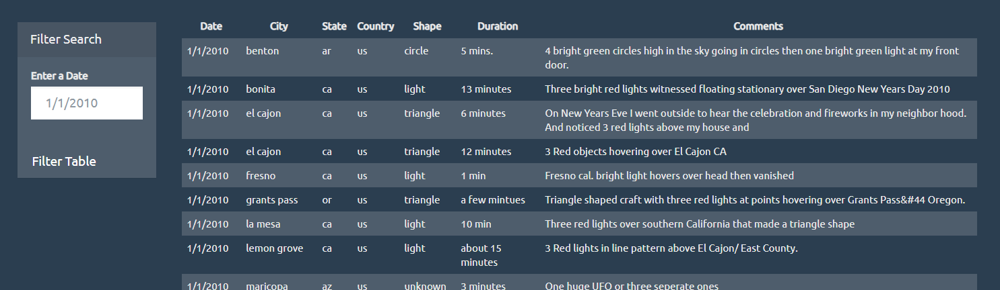
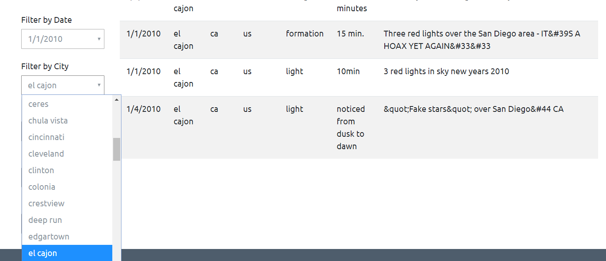

# UFO Sightings Data - JavaScript and DOM Manipulation

## First Extraterrestrial Challenge

**Automatic Table and Date Search**

* Using the UFO dataset provided in the form of an array of JavaScript objects, I wrote code that appends a table to my HTML webpage and then adds new rows of data for each UFO sighting. In order to append the UFO data to a table in HTML, I used d3 to select the HTML properties needed to append/nest "tr" and "td" elements and create the table framework. To append the 
UFO data as text, I looped through the dataset and pulled each value from each object and inserted the data as text within the "td" tag. The result is a table on our webpage displaying the date from an array of JavaScript objects.

* Using a form in my HTML, I wrote code that will listen to "click" and "submit" events and, when triggerd, will kick off a funtion to take the user input, and then filter the UFO data by the user input. The function would also clear the exiting HTML containing exiting UFO data and then display the filter data. I wrote my code to specifically listen for a date input would
would be used to loop through the UFO data and only return data where the date/time value equaled the user input. Using a similar method in the above task, I then looped through the filtered data and appened the value of each obeject as text within the appened HTML element, sucessfully displaying a table that is filtered by the date the user inputted. 

## Second Extraterrestrial Challenge

**Multiple Search Categories**

* I created 5 drop downs to be displayed on my webpage where the user can select a unqiue Date, City, State, Country, and Shape and filter the table by the users selection. First, I added "select" elements to my HTML, each with a unique ID, so that I could reference in my javascript to display unique selection options. With the "select" elements in place, I used d3 and Javascript
to select those elements and insert unique data taken from the UFO dataset. To get unique values from the dataset, I created a fucntion to return all of the dates from the date/column and hold those values in a list. Then I created another function to go through that list and apply indexOF which returned only unique values. Finally, with a list of unqiue values, I looped through
each value in the list and appended an "option" element with the "select" element, and a "value" attribtute within the "option" element", all by using d3. Lastly, I appended the text return from each run of the for loop and inserted the value in to the "option" element and "value" attribute. I repeated this process for each of the 5 drop downs.

With the drop down in place, I created 5 different event listeners that would call on a function to filter the table by the users selection. This method was similar to the method used in the first challenge. The only differnce was the elements that we listend for and selected to find the user input and then use that input to filter the tabel and display the filtered data. 

